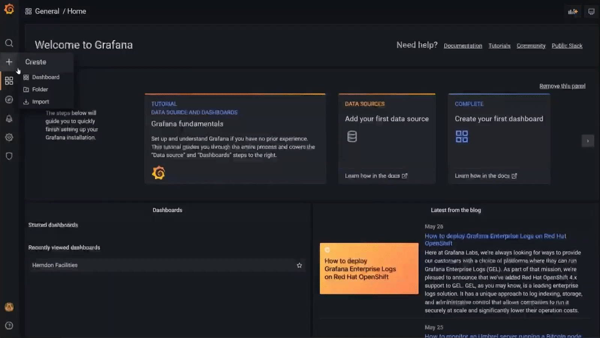

# Setting Up a Grafana Dashboard - Guide

## Getting Started

These instructions will take you through setting up a Grafana dashboard connected to an InfluxDB data source using data from NodeRED.

__In this lab you will__
1. Set Up Grafana
2. Build InfluxDB database
2. Connect to InfluxDB Data Source
3. Create a basic Dashboard

__You will need:__
* Grafana
* InfluxDB v2.3 (at least v1.8+)

## Grafana Set Up

### Installing Grafana

Since we're setting up a Grafana dashboard in this lab, we'll need to [install](https://grafana.com/docs/grafana/latest/installation/) Grafana. Please select your corresponding operating system and follow the instructions.

Next, you'll want to [configure](https://grafana.com/docs/grafana/latest/administration/configuration/) Grafana. Again, follow the instructions for your operating system. As noted in the configuration guide, you'll need to remove comments in the .ini files by removing the ```;``` at the beginning of the lines you want to change.

### Logging In

1. Open your web browser and go to http://localhost:3000/. The default HTTP port that Grafana listens to is ```3000``` unless you configured a different port in the previous step. If you are not hosting Grafana locally, then go to ```http://[host]:3000/``` instead.
2. On the login page, enter ```admin``` as the username and password.
3. Click **Log in**. If the login is successful, you will see a prompt to change the password.
4. Click **OK** on the prompt, then change your password.

### Installing InfluxDB

Before you start displaying data on your dashboard, you will need to first build a database that you can query your data from. We will be using InfluxDB to do this. Start by [installing](https://docs.influxdata.com/influxdb/v2.3/install/) InfluxDB v2.3 by selecting the corresponding operating system and following the instructions to download and install both InfluxDB and the influxCLI.

Once you get to the **Start InfluxDB** section, if ```./influxd``` command not working, check to see if the influxd.exe is in the current directory. If not, you may need to ```cd``` into influxdb2-2.3.0-windows-amd64 before running the command 

You have the option of setting up InfluxDB either through the UI or CLI. Note that in the latest version of InfluxDB (v2.3), a bucket is a named location where time series data is stored. It’s similar to an InfluxDB v1.x “database,” but is a combination of both a database and a retention policy.

### Add InfluxDB as a data source

1. Move your cursor to the cog icon on the side menu which will show the configuration options.

2. Click on **Data sources**. The data sources page opens showing a list of previously configured data sources for the Grafana instance.
3. Click **Add data source** to see a list of all supported data sources.
4. Select **InfluxDB** from the list of available data sources.
5. On the Data Source configuration page, enter a **name** for your InfluxDB data source.
6. Under **Query Language**, select **Flux**.
7. Under **HTTP**, enter the following:
    * **URL**: Your [InfluxDB URL](https://docs.influxdata.com/influxdb/v2.3/reference/urls/).
    * **Access**: Server (default)
8. Under **Auth**, turn the **Basic auth** toggle on. 
9. Under **Basic Auth Details**, enter the username and password you made during your InfluxDB setup next to **User** and **Password** respectively.
10. Under **InfluxDB Details**, enter the following:
    * **Organization**: Your InfluxDB [organization ID](https://docs.influxdata.com/influxdb/v2.3/organizations/view-orgs/).
    * **Token**: Your InfluxDB [API token](https://docs.influxdata.com/influxdb/v2.3/security/tokens/).
    * **Default Bucket**: The default [bucket](https://docs.influxdata.com/influxdb/v2.3/organizations/buckets/) to use in Flux queries.
    * **Min time interval**: The [Grafana minimum time interval](https://grafana.com/docs/grafana/latest/features/datasources/influxdb/#min-time-interval). Default is ```10s```
    * **Max series**: The maximum number of series or tables Grafana will process. Default is ```1000```.
11. Click **Save & Test**. Grafana attempts to connect to the InfluxDB 2.3 datasource and returns the results of the test.


### Creating a Dashboard

1. Click the **New dashboard** item under the **Dashboards** icon in the side menu.
2. On the dashboard, click **Add a new panel**.

3. Under the **Query** tab, select your InfluxDB data source from the data source selector.
4. In the following box, use [Flux](https://docs.influxdata.com/influxdb/v2.3/query-data/get-started/query-influxdb/) to query data from InfluxDB.
    * You can also use the InfluxDB GUI to help you generate your query by selecting the ```_measurement``` and ```_field``` you want to pull from your database. 
    * Click **Submit** on the right side to see a visualization of your query, and the **Script Editor** button will generate the query in Flux.
    * Then copy and paste the Flux query into the box in Grafana.
5. On the right side there is an option pane where you can change the type of visualization, add a panel title, and edit other panel settings.
6. Once you've finished making the panel, click **Save** at the top right of your screen to save the dashboard.
7. Add a name for your dashboard, then click **Save**.

Congratulations, you have created your first dashboard and it is displaying results!


